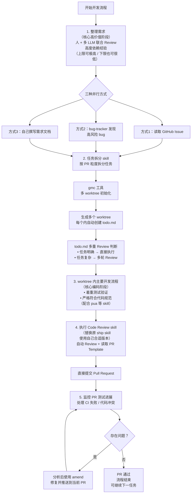

```mermaid
flowchart TD
    Start[开始开发流程]
    --> Req[1. 整理需求<br/>（核心高价值阶段）<br/>人 + 多 LLM 联合 Review<br/>高度依赖经验<br/>（上限可极高 / 下限也可很低）]

    Req --> Ways{三种并行方式}

    Ways --> GH[方式1：读取 GitHub Issue]
    Ways --> Bug[方式2：bug-tracker 发现<br/>高风险 bug]
    Ways --> Doc[方式3：自己撰写需求文档]

    GH & Bug & Doc --> Split[2. 任务拆分 skill<br/>按 PR 粒度拆分任务]

    Split --> GMC[gmc 工具<br/>多 worktree 初始化]

    GMC --> WT[生成多个 worktree<br/>每个内自动创建 todo.md]

    WT --> TodoRev[todo.md 多重 Review 判断<br/>• 任务明确 → 直接执行<br/>• 任务复杂 → 多轮 Review]

    TodoRev --> Dev[3. worktree 内主要开发流程<br/>（核心编码阶段）<br/>• 着重测试验证<br/>• 严格符合代码规范<br/>（配合 pua 等 skill）]

    Dev --> CodeReview[4. 执行 Code Review skill<br/>（替换原 ship skill<br/>使用自己合适版本）<br/>自动 Review + 读取 PR Template]

    CodeReview --> Submit[直接提交 Pull Request]

    Submit --> Monitor[5. 监控 PR 测试进展<br/>处理 CI 失败 / 代码冲突]

    Monitor --> Issue{存在问题？}

    Issue -->|是| Amend[分析后使用 amend<br/>修复并推送到当前 PR]
    Amend --> Monitor

    Issue -->|否| End[PR 通过<br/>流程结束<br/>可继续下一任务]
```
